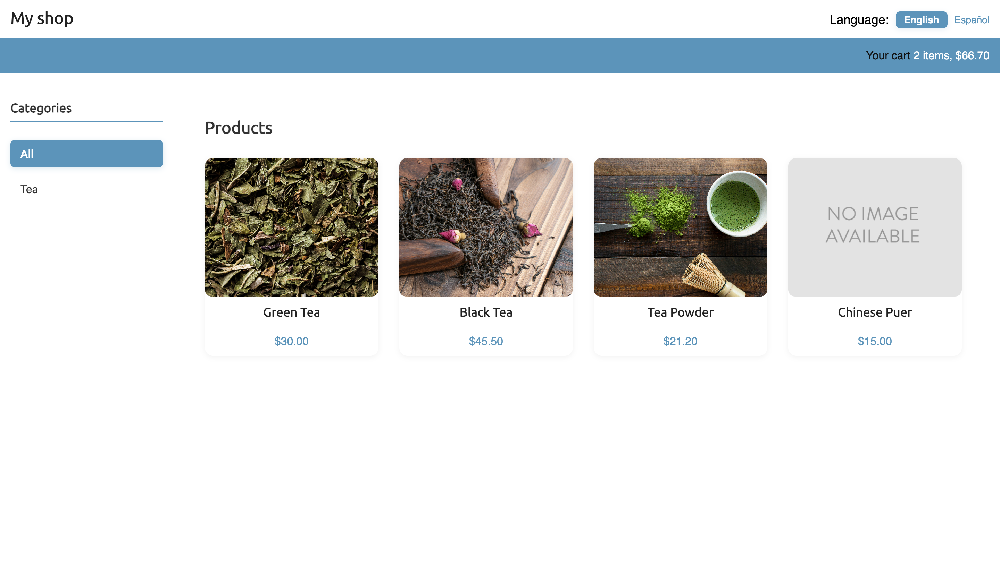
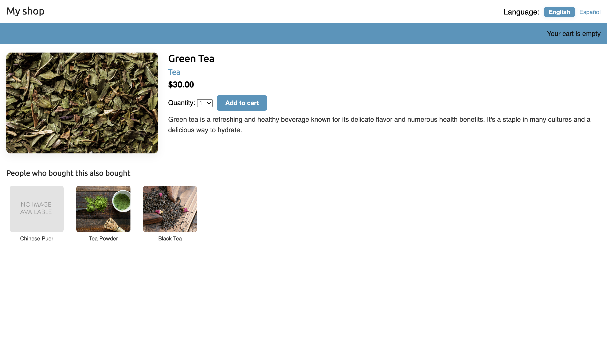
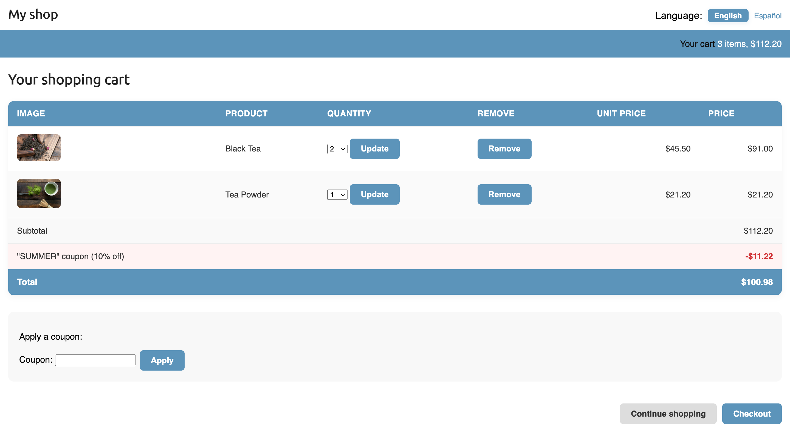
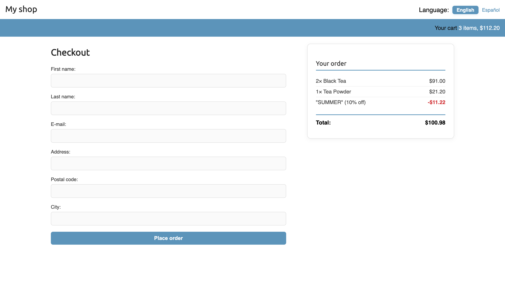
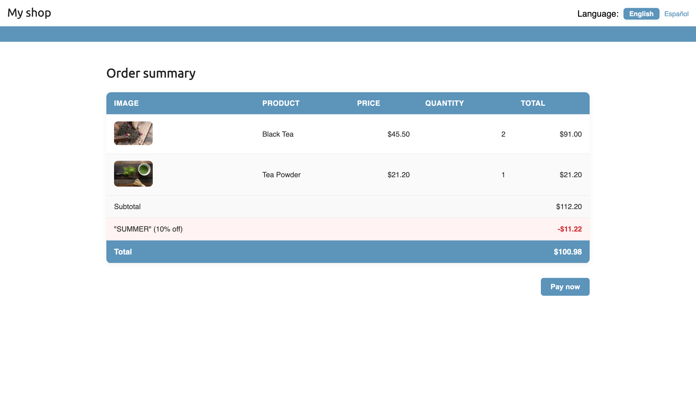

# 🛒 Django Shop - Full-Featured E-Commerce Platform

A production-ready e-commerce application built with Django 5.2, PostgreSQL, Redis, Celery, Stripe, and Docker. Started as a learning project from a book and significantly enhanced with modern best practices, comprehensive testing, CI/CD pipeline, and more.


## 🎯 Project Overview

A full-featured online tea shop with product catalog, shopping cart, coupon system, Stripe payments, PDF invoices, and a Redis-based recommendation engine. The project demonstrates Django best practices including async task processing with Celery, internationalization, and a clean modular structure.

### Original vs Enhanced

**Original Book Features:**
- Product catalog with categories
- Shopping cart via sessions
- Coupon system
- Stripe payments
- PDF invoice generation with WeasyPrint
- Redis-based recommendation engine
- Celery async tasks
- Internationalization (EN/ES)

**My Enhancements:**
- 🐛 **Bug Fixes** — fixed critical bugs in webhook handler, coupon model, recommender
- 🗄️ **Database** — switched to PostgreSQL, added proper indexes on all models
- ⚡ **Performance** — fixed N+1 queries with select_related/prefetch_related
- 🧪 **Comprehensive Testing** — 61 tests, 90% coverage with pytest and mocking
- 🐳 **Docker** — full stack with PostgreSQL, Redis, Celery, Flower, Nginx
- 🔄 **CI/CD Pipeline** — GitHub Actions with tests, lint and coverage check
- 📝 **Code Quality** — pre-commit hooks with black, isort, flake8
- 🔒 **Security** — environment variables via python-decouple, no hardcoded secrets
- 📋 **Logging** — structured logging in webhooks, tasks, and views
- ⚙️ **Settings** — clean settings with sections, CELERY_* config, email config

## 📸 Screenshots

| Main Page | Product Info | Cart | Checkout | Order Summary |
|-----------|--------------|-----------|-----------|-----------|
|  |  |  |  |  |

## 🛠️ Tech Stack

### Backend
- **Django** 5.2 — Web framework
- **PostgreSQL** 16 — Primary database
- **python-decouple** — Environment variables management
- **django-parler** — Model translations (EN/ES)
- **WeasyPrint** — PDF invoice generation

### Payments
- **Stripe** — Payment processing via Checkout Sessions
- **Stripe Webhooks** — Async payment confirmation

### Task Queue
- **Celery** — Async task processing
- **Redis** — Message broker and recommendation engine storage
- **Flower** — Celery monitoring dashboard

### Testing
- **pytest-django** — Testing framework
- **pytest-cov** — Code coverage reporting
- **unittest.mock** — Mocking external services (Stripe, Redis)

### DevOps
- **Docker** & **Docker Compose** — Full stack containerization
- **Nginx** — Reverse proxy, static and media files serving
- **Gunicorn** — WSGI server
- **GitHub Actions** — CI/CD pipeline
- **pre-commit** — Git hooks for code quality
- **black** / **isort** / **flake8** — Code formatting and linting

## 📋 Features

### Shop
- ✅ Product catalog with categories
- ✅ Product detail with recommendations
- ✅ Redis-based "bought together" recommendation engine
- ✅ Product images with fallback
- ✅ Internationalization (English / Spanish)

### Cart
- ✅ Session-based shopping cart
- ✅ Add / remove / update quantity
- ✅ Coupon discounts
- ✅ Cart total with discount calculation

### Orders
- ✅ Order creation with customer details
- ✅ Order confirmation email via Celery
- ✅ PDF invoice generation and email delivery
- ✅ Admin order management with CSV export
- ✅ Stripe payment link in admin

### Payments
- ✅ Stripe Checkout integration
- ✅ Webhook handler for payment confirmation
- ✅ Stripe coupon creation on checkout
- ✅ Test mode support

### Coupons
- ✅ Percentage discount coupons
- ✅ Valid date range
- ✅ Active/inactive status
- ✅ Case-insensitive code lookup

## 🚀 Getting Started

### Prerequisites
- Docker & Docker Compose
- Git
- Stripe account (for payments)

### Quick Start with Docker

1. **Clone the repository**
```bash
git clone https://github.com/egorpusto/django-shop.git
cd django-shop
```

2. **Create environment file**
```bash
cp .env.example .env
# Edit .env — fill in SECRET_KEY and Stripe keys
```

3. **Start all services**
```bash
docker compose up -d
```

4. **Create superuser**
```bash
docker compose exec web python manage.py createsuperuser
```

5. **Access the application**
- Shop: http://localhost:8000
- Admin: http://localhost:8000/admin
- Flower: http://localhost:5555

### Local Development Setup

1. **Clone & create virtual environment**
```bash
git clone https://github.com/egorpusto/django-shop.git
cd django-shop
python -m venv venv
source venv/bin/activate
```

2. **Install dependencies**
```bash
pip install -r requirements.txt
pip install -r requirements-dev.txt
```

3. **Configure environment**
```bash
cp .env.example .env
# Fill in required variables
```

4. **Start PostgreSQL and Redis via Docker**
```bash
docker compose up db redis -d
```

5. **Run migrations**
```bash
python manage.py migrate
```

6. **Run development server**
```bash
python manage.py runserver
```

### Testing Stripe Payments

Use Stripe CLI to forward webhooks locally:
```bash
stripe listen --forward-to localhost:8000/payment/webhook/
```

Test card: `4242 4242 4242 4242`, any future date, any CVC.

## 🧪 Testing
```bash
# Run all tests
pytest

# Run with coverage
pytest --cov=. --cov-report=term-missing

# Run specific app
pytest orders/tests.py -v
```

## 🏗️ Project Structure
```
myshop/
├── cart/                    # Shopping cart (session-based)
├── coupons/                 # Discount coupon system
├── orders/                  # Order management + PDF invoices
├── payment/                 # Stripe payments + webhooks
├── shop/                    # Product catalog + recommendations
│   └── recommender.py       # Redis-based recommendation engine
├── myshop/                  # Project configuration
│   ├── settings.py
│   ├── celery.py
│   └── urls.py
├── nginx/                   # Nginx configuration
│   └── nginx.conf
├── locale/                  # Translation files (EN/ES)
├── .env.example
├── .flake8
├── .github/workflows/ci.yml
├── .pre-commit-config.yaml
├── .gitignore
├── docker-compose.yml
├── Dockerfile
├── manage.py
├── pyproject.toml
├── pytest.ini
└── requirements.txt
```

## 🐳 Docker Services

| Service | Description | Port |
|---|---|---|
| web | Django + Gunicorn | — |
| nginx | Reverse proxy | 8000 |
| db | PostgreSQL 16 | — |
| redis | Redis 7 | — |
| celery | Celery worker | — |
| celery-beat | Celery scheduler | — |
| flower | Celery monitor | 5555 |
```bash
# Start all services
docker compose up -d

# View logs
docker compose logs -f web

# Run management commands
docker compose exec web python manage.py <command>

# Stop all services
docker compose down
```

## ⚙️ Environment Variables

See `.env.example` for all available variables. Required:
```env
SECRET_KEY=
DB_NAME=
DB_USER=
DB_PASSWORD=
STRIPE_PUBLISHABLE_KEY=
STRIPE_SECRET_KEY=
STRIPE_WEBHOOK_SECRET=
```

## 🔄 CI/CD Pipeline

Every push to `main` automatically:
- Runs flake8 linting
- Runs 61 tests with PostgreSQL + Redis
- Checks coverage ≥ 80%

## 📝 Code Quality
```bash
# Install pre-commit hooks
pre-commit install

# Run manually
pre-commit run --all-files
```

## 🚧 Future Improvements

- [ ] User authentication and order history
- [ ] Product search
- [ ] Product reviews and ratings
- [ ] Deploy to Railway / Render

## 👤 Author

**Egor Anoshin**
- GitHub: [@egorpusto](https://github.com/egorpusto)

## 🙏 Acknowledgments

- Based on "Django 5 By Example" by Antonio Melé
- Enhanced with bug fixes, PostgreSQL, Docker, Nginx, comprehensive testing, CI/CD, and logging

---

**Note:** This project started from a book tutorial and was significantly enhanced as a portfolio piece.
