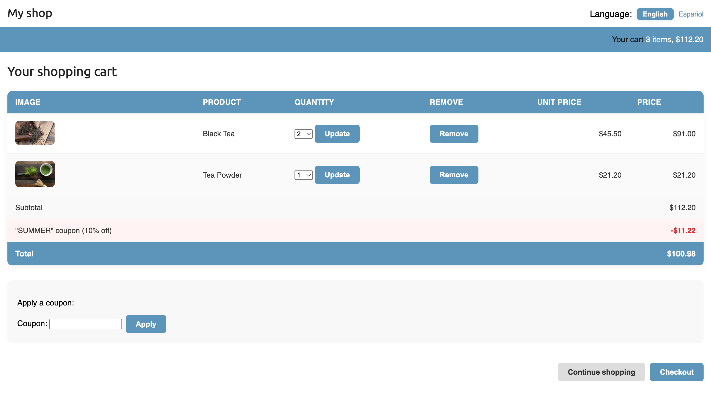

# 🛒 Django Shop Project

A fully-featured online shop built with Django, featuring product management, shopping cart, payments via Stripe, coupons, and multi-language support. 🌍

---

## ✨ Features

- **Product management:** Add, edit, and delete products via the Django admin panel.  
- **Shopping system:** Users can browse products, add them to a cart, and complete orders.  
- **Stripe payment gateway:** Secure payment processing with webhook handling.  
- **Asynchronous tasks:** Celery with RabbitMQ for background processing.  
- **PDF invoices:** Dynamically generated invoices for orders in PDF format.  
- **CSV export:** Export all orders to CSV files for easy reporting.  
- **Coupon system:** Apply discount coupons to orders.  
- **Internationalization & localization:** Multi-language support using `django-parler` and `Rosetta`.  
- **Recommendation engine:** Redis-powered product recommendations.

---

## 📸 Screenshots

| Main Page | Product Info | Cart | Checkout | Order Summary |
|-----------|--------------|-----------|-----------|
|  |  |  |  |  |

---

## 🛠 Tech Stack

**Backend:**  
- Python 3.12+ 
- Django 5.0
- Celery + RabbitMQ
- Stripe (payment gateway)
- Redis (for recommendations)

**Frontend:**  
- Vanilla HTML, CSS & JS

## 🚀 Quick Start

### 1. Clone repo
git clone https://github.com/egorpusto/django-shop
cd django-shop

### 2. Create a virtual environment and install dependencies:
1. python -m venv venv
2. source venv/bin/activate  # Windows: venv\Scripts\activate
3. pip install -r requirements.txt

### 3. Set up environment variables in a .env file:
SECRET_KEY=your-secret-key
DEBUG=True
STRIPE_PUBLIC_KEY=your-stripe-public-key
STRIPE_SECRET_KEY=your-stripe-secret-key

### 4. Apply migrations:
python manage.py migrate

### 5. Create admin
python manage.py createsuperuser

---

## ⚙️ Running the Project

### Start RabbitMQ
docker run -it --rm --name rabbitmq -p 5672:5672 -p 15672:15672 rabbitmq:management

### Start Celery worker
celery -A myshop worker -l info

### Start Stripe webhook listener
stripe listen --forward-to 127.0.0.1:8000/payment/webhook/

### Start Redis
docker run -it --rm --name redis -p 6379:6379 redis

## Run the Django development server:
python manage.py runserver

---

## 💡 Notes

* Make sure Docker is installed for RabbitMQ and Redis. 🐳

* The project supports multiple languages. Use the language selector in the header to switch. 🌐

* Admin panel allows full product management.

---

## 🗂 Folder Structure Structure

- `myshop//`
  - `myshop/` — Django project settings
  - `shop/` — Shop app with models, views, templates
  - `cart/` - Cart app
  - `orders` - Orders app
  - `coupons` - Coupons app
  - `payment` - Stripe integration
  - `.gitignore` - Specifies untracked files
  - `manage.py` — Management script
  - `requirements.txt` — Dependencies

---

Made with ❤️ by egorpusto